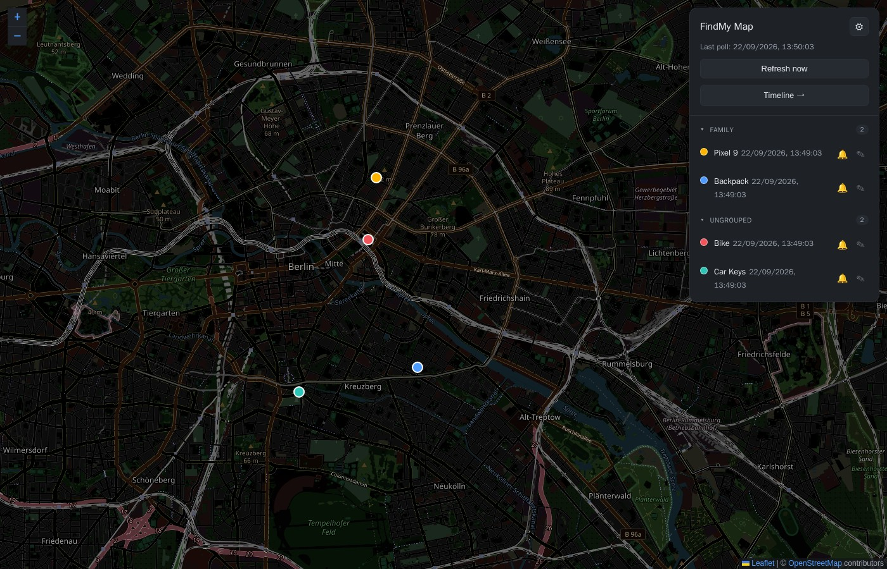
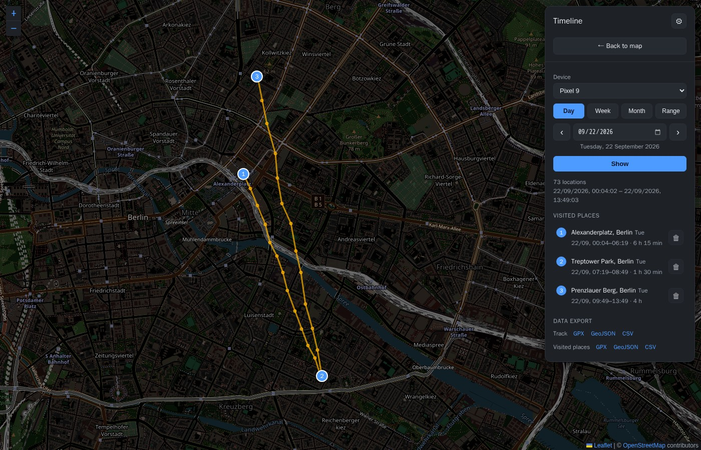
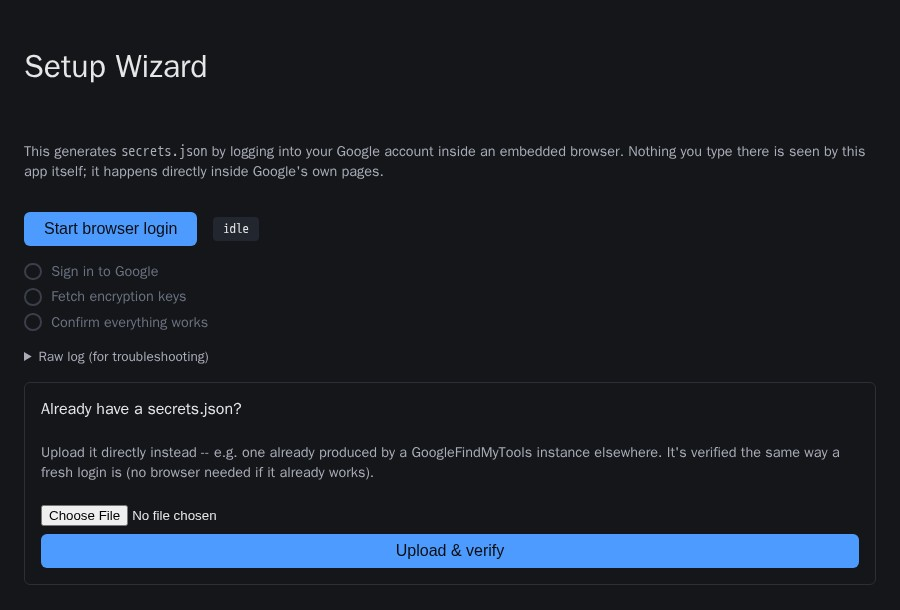

# findmy-map
[](https://github.com/Don-Wombat/google-findmy-map/actions/workflows/ci.yml)

Shows the locations of the devices registered with Google "Find My Device"
(phone, ESP32 tracker, …) on a real map (Leaflet + OpenStreetMap) instead of
just a Google Maps link in the terminal. On top of that: a history track for a
chosen time range and a text-oriented list of visited places (similar to the
Google Timeline).

The service builds on the
[`leonboe1/GoogleFindMyTools`](https://github.com/leonboe1/GoogleFindMyTools)
library. It needs a `secrets.json` with valid Google tokens — either shared
from an already-configured GoogleFindMyTools container, or generated
directly with the built-in [setup wizard](#getting-started), no separate
instance required.

> This project is not affiliated with Google or Apple. Use at your own risk and
> only for devices/accounts you are authorised to access.

## Screenshots







<sub>All screenshots use synthetic demo data (fictional devices moving around Berlin), not real location history.</sub>

## Getting started

### 1. Get the compose files

No clone needed — the image is pulled from GHCR:

```bash
mkdir google-findmy-map && cd google-findmy-map
curl -O https://raw.githubusercontent.com/Don-Wombat/google-findmy-map/main/docker-compose.yml
curl -o .env https://raw.githubusercontent.com/Don-Wombat/google-findmy-map/main/.env.example
```

To build from source instead: clone the repo, flip `image:` to `build: .`
in `docker-compose.yml`, and add `--build` to the `up -d` in step 3.

### 2. Get a secrets.json

**Already have a logged-in GoogleFindMyTools container?** Point
`GFM_SECRETS_FILE` (step 3) at its `Auth/secrets.json` and skip ahead —
nothing else to do here.

**Starting from scratch?** Use the built-in **setup wizard** — a second,
opt-in container with an embedded browser that walks you through signing
in to Google yourself; this app's own code never sees your password.

```bash
# GFM_SECRETS_FILE must exist as a file before the very first run:
mkdir -p "$(dirname "$GFM_SECRETS_FILE")"
echo '{}' > "$GFM_SECRETS_FILE"

docker compose --profile setup-wizard up -d setup-wizard
docker compose logs setup-wizard   # prints a one-time URL with ?token=...
```

Open that URL (via whatever reverse-proxy host you've pointed at it — no
port is published, same as the main app) and either **start the browser
login** (two Google sign-in prompts in a row is normal, not a bug) or
**upload an existing `secrets.json`** from elsewhere — verified against the
real API either way. Once it reports success, stop the wizard again; it's
not needed for normal operation:

```bash
docker compose --profile setup-wizard down
```

Something not working? `docker compose logs -f setup-wizard` shows
everything, not just what fits on the page. This is a real browser with
live Google network access — read the "Setup wizard" section in
`SECURITY.md` before using it. Set `GFM_SETUP_WIZARD_URL` (below) to also
link it from the main app's settings page.

### 3. Configure and start

| Variable | Meaning |
|---|---|
| `GFM_SECRETS_FILE` | Host path to the **single** `secrets.json` from step 2. Bind-mounted read-write so token refreshes stay in sync. Do **not** mount the whole `Auth/` folder — only this one file. |
| `GFM_DATA_DIR` | Host directory for the SQLite database (`history.db`) — treat it as personal data. |
| `PUID` / `PGID` | Owner of the two paths above; the app runs as this user. Check with `stat -c '%u:%g' "$GFM_SECRETS_FILE"`. |
| `PROXY_NETWORK` | Name of the external Docker network your reverse proxy is on. |

All other (optional) variables are documented in `.env.example` and in
[Environment variables](#environment-variables) below.

```bash
docker compose up -d
```

## Web UI

### Map

- **Light/dark** and **language (EN/DE)** toggles in the header, both
  remembered in the browser. Dark mode darkens the OSM tiles via a CSS
  filter — no API key needed, and building outlines and labels stay intact.
- The map fills the screen; devices sit in a **floating panel** (a
  collapsible bottom sheet on mobile), sorted by most recent location.
  Each has its own pin colour and a track of its last 5 positions.
- **Edit** (✎) a device to rename it, pick a pin colour, or put it in a
  free-text **group** — grouped devices collapse into sections, and
  collapsing one also hides its pins from the map. **Default** clears all
  three.
- **Ring** (🔔) plays the device's "find my device" sound; tap again (or
  wait ~30s) to stop.
- A **semantic location** (a named place with no coordinates, e.g. "Home")
  gets no map pin but still shows in the device list.
- A red **banner** appears after `GFM_POLL_ALERT_AFTER` failed polls in a
  row (default 3) and clears itself once polling recovers — `GET
  /api/health` exposes the same state for an external uptime monitor.

### Timeline

- Step through **Day / Week / Month**, or a free **Range**, per device —
  the full track plus a list of **visited places** (address, duration),
  each deletable individually — this permanently removes the underlying
  location history for that stay and cannot be undone. A visit needs
  enough history clustered in one spot (`GFM_VISIT_RADIUS_M`,
  `GFM_VISIT_MIN_MINUTES`) to form; it fills in as more data comes in.
- **Export** GPX / GeoJSON / CSV for the track or visited places, scoped
  to the chosen device and date range.

### Settings

- **Add a tracker** registers a new generic BLE/FMDN tracker (e.g. this
  project's own ESP32 firmware) with your Google account and shows the
  resulting advertisement key once, to flash into the tracker's own
  firmware. Needs `secrets.json` to already have a cached `owner_key` — run
  the setup wizard (or an existing GoogleFindMyTools login) at least once
  first.
- **Old devices** that dropped out of the poll can be deleted — id-keyed,
  not name-keyed (renamed duplicates stay distinguishable), and a still-live
  device can't be deleted.
- **Reset history** wipes just a device's location data, keeping its
  name/colour/group.
- Per-device **full-history export**, and (if `GFM_SETUP_WIZARD_URL` is
  set) a link to the setup wizard.

### Authentication

Optional, **off by default**. On the settings page (⚙), tick **Require
login** and set a username + password (min. 8 characters) — both required
the first time. Change them, or turn auth off again, later from the same
page.

Locked out? Set `GFM_AUTH_DISABLE=1` and restart to force it off. With auth
enabled you can expose the service directly, but **only over HTTPS** (see
`SECURITY.md`).

## How it works

- `Dockerfile` clones `GoogleFindMyTools` (commit pinned via
  `ARG GFM_UPSTREAM_REF`) into `/app/vendor`.
- `docker-compose.yml` mounts only the single `secrets.json` into the vendored
  `Auth` folder — login data / token refresh shared rather than duplicated,
  without overwriting the rest of the vendored auth code. The container
  starts as root; `entrypoint.sh` chowns the data volume to `PUID:PGID`,
  then execs the app via `gosu` as that user, so the long-running process
  is never root.
- `service/locations.py` uses the library functions but returns structured
  data instead of only printing it.
- `service/main.py` — FastAPI + a background poll thread. Endpoints:
  `GET /api/locations` (incl. `palette` and `poll_alert`), `GET /api/health`
  (public liveness probe — `{ok, poll_alert, last_poll, …}`, no error
  detail), `GET /api/devices` (every device ever seen, for the timeline
  picker, with a `live` flag and `point_count`), `GET /api/history`,
  `GET /api/visits`, `GET /api/export/history` and `GET /api/export/visits`
  (`?format=gpx|geojson|csv`, optional `start`/`end`), `POST /api/refresh`,
  `PUT /api/devices/{id}`, `DELETE /api/devices/{id}` (stale devices only —
  409 while live), `DELETE /api/history` (deletes a device's location fixes
  in a required `start`/`end` window — used to delete one visited place),
  `DELETE /api/devices/{id}/history` (resets a device's history, keeping
  its name/colour/group — no liveness restriction),
  `POST /api/devices/{id}/ring[/stop]`. The mutating endpoints reject
  cross-site requests (Fetch Metadata).
- `service/export.py` — the GPX / GeoJSON / CSV formatters (stdlib only).
- `service/store.py` — SQLite: full history (`add`/`recent`/`range` + a
  one-time `history.json` migration), device overrides (name / colour /
  group), geocode cache. New columns are added to an existing DB on
  startup (`_migrate_schema`).
- `service/colors.py` (pin colour, with validation), `service/augment.py`
  (track/name/colour/group per device), `service/visits.py` (clusters
  points into stays), `service/geocode.py` (reverse geocoding via
  Nominatim, ≤ 1 request/1.1 s, negative cache + backoff),
  `service/auth.py` (the optional built-in login),
  `service/register_device.py` (registers a new tracker with Google;
  re-implements the vendored `register_esp32()` with a custom device name,
  since that function hardcodes one).
- `web/index.html` (map), `web/timeline.html`, `web/settings.html`
  (theme / language / login / data export / device-history reset /
  old-device deletion / tracker registration),
  `web/login.html`, `web/app.css`, `web/app.js`.
- `setup/` — the opt-in setup wizard, a separate image/container (own
  `Dockerfile`, not built or started by default). A virtual X display
  (Xvfb) runs a real, non-headless Chromium, streamed into a browser tab via
  noVNC/websockify; a small FastAPI app (`setup/app/main.py`) gates access
  behind a one-time token, drives the vendored login chain in a watched
  subprocess (`setup/app/run_flow.py`) with a hard timeout, and writes
  directly into the same `secrets.json` `findmy-map` uses. The
  embedded-browser-over-noVNC approach was inspired by
  [`Smeagolworms4/GoogleFindMyTools`](https://github.com/Smeagolworms4/GoogleFindMyTools),
  which does the same for the underlying CLI tool itself. See "Getting
  started" above and the "Setup wizard" section in `SECURITY.md`.

## Environment variables

See `.env.example`. Summary:

| Variable | Default | Purpose |
|---|---|---|
| `GFM_POLL_INTERVAL_SECONDS` | `120` | Poll interval |
| `GFM_HISTORY_DB` | `/data/history.db` | SQLite DB (full history + settings + geocode cache) |
| `GFM_HISTORY_FILE` | `/data/history.json` | only for a one-time migration from an earlier version |
| `GFM_DEVICE_COLORS` | – | JSON `{id-or-name: hex/keyword}`. Priority: UI colour → env → palette |
| `GFM_NOMINATIM_URL` | public OSM Nominatim | reverse geocoding; **empty = off** |
| `GFM_GEOCODE_EMAIL` | – | contact email sent as the `email=` parameter (OSM policy) |
| `GFM_VISIT_RADIUS_M` / `GFM_VISIT_MIN_MINUTES` | `100` / `15` | definition of a "visited place" |
| `GFM_HISTORY_RETENTION_DAYS` | – | delete location fixes older than this many days; **empty = keep forever** (unchanged default) |
| `GFM_POLL_ALERT_AFTER` | `3` | show the "updates are failing" banner after this many failed poll cycles in a row; `0` disables it |
| `GFM_AUTH_DISABLE` | – | `1` forces the optional login off (recovery from a lost password) |
| `GFM_LOGIN_DELAY_MS` | `500` | fixed delay per login attempt |
| `GFM_SETUP_WIZARD_URL` | – | shows an "Open Setup Wizard" link on the settings page when set |
| `GFM_SETUP_TOKEN_TTL` | `900` | (setup-wizard service) how long its printed token stays redeemable |
| `GFM_SETUP_RUN_TIMEOUT_SECONDS` | `900` | (setup-wizard service) hard ceiling on one wizard run |

## Known limitations

- The location history grows unbounded unless you opt into
  `GFM_HISTORY_RETENTION_DAYS` — it defaults to off, so an upgrade never
  starts silently deleting data an existing install never asked to lose.
- "Semantic locations" (named places without coordinates, e.g. "Home") never
  get a map pin — Google's API sends no coordinates for them, so there is
  nothing to place on the map. The name is shown in the device list instead.
- On an owner-key version change, `secrets.json` must be regenerated —
  either in the existing GoogleFindMyTools container, or by re-running the
  [setup wizard](#getting-started) (it only overwrites the keys it
  re-fetches, so a re-run resumes rather than starting over).
- `secrets.json` is written non-atomically by both containers; a conflict on an
  exactly simultaneous token refresh is theoretically possible, in practice
  unlikely.
- The "Add a tracker" advertisement key is shown exactly once and never
  stored by this app, same as the upstream CLI — copy it before leaving the
  page, or register a new one if it's lost.

## License

[MIT](LICENSE)
